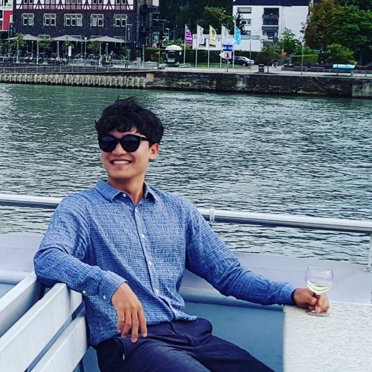

<h1 style="text-align: center;"><a name="top">Me</a></h1>

## Yanghoon Kim
### Ph.D Student
### Dept. of Electrical and Computer Engineering
### Seoul National University
### Email: <a href="mailto:ad26kr@snu.ac.kr">ad26kr@snu.ac.kr</a>

***

# List

* [News](#News)
* [Education](#Education)
* [Professional Experience](#Experience)
* [Publications](#Publications)

***

# News
- Apr, 2018: One paper is accepted to <a href="http://alt.qcri.org/semeval2019/">SemEval 2019</a>
- Mar, 2019: I gave a talk at <a href="https://www.navercorp.com/en">Naver</a>, <a href="https://youtu.be/JNVBxVparr0">Improving Neural Question Generation Using Answer Separation</a>
- Nov, 2018: One paper is accepted to <a href="https://aaai.org/Conferences/AAAI-19/">AAAI 2019</a>
- Apr, 2018: One paper is accepted to <a href="http://alt.qcri.org/semeval2018/">SemEval 2018</a>
- Jan, 2018: One paper is accepted to <a href="http://www.bigcomputing.org/">BigComp 2018</a>

[[Top]](#top)

# Education

<li style="line-height:1.4em">
  
  <li >
	<strong>Seoul National University</strong>
	 Ph.D student in Department of Electrical and Computer Engineering (2014.09 - Now)
	 Advisor: Kyomin Jung
  </li>	
	  
  <li >
	<strong>Tsinghua University</strong>
	 B.S. in Department of Automation (2010.09 - 2014.07)
  </li>	

[[Top]](#top)

# Professional Experience
- <strong>Reviewer</strong> of <a href="https://ieeeaccess.ieee.org/">IEEE Access(2020)</a>
- <strong>Co-reviewer</strong> of <a href="http://icdm2019.bigke.org/">ICDM(2019)</a>
- <strong>Reviewer</strong> of <a href="https://www.jjcit.org">JJCIT(2019)</a>
- <strong>Reviewer</strong> of <a href="http://alt.qcri.org/semeval2018/">SemEval 2018</a>
- <strong>Research intern</strong> @ Samsung Advanced Institute of Technology (SAIT), summer of 2017 
- <strong>Research intern</strong> @ UAV LAB, Tsinghua Univ, 2013 - 2014

[[Top]](#top)

# Publications

<ol style="line-height:1.4em" reversed>
  
  <li >
	<strong>MILAB at SemEval-2019 Task 3: Multi-View Turn-by-Turn Model for Context-Aware Sentiment Analysis</strong>
	[<a href="https://www.aclweb.org/anthology/S19-2043/">paper</a>]
	 <i>Yoonhyung Lee, <u>Yanghoon Kim</u> and Kyomin Jung</i>
	 <a href="http://alt.qcri.org/semeval2019/">SemEval 2019</a>
  </li>	  
	  
  <li >
	<strong>Improving Neural Question Generation using Answer Separation</strong>
	[<a href="https://aaai.org/ojs/index.php/AAAI/article/view/4629">paper</a>]
	[<a href="https://github.com/yanghoonkim/NQG_ASs2s">code</a>]
	 <i><u>Yanghoon Kim</u>, Hwanhee Lee, Joongbo Shin and Kyomin Jung</i>
	 <a href="https://aaai.org/Conferences/AAAI-19/">AAAI 2019</a>
  </li>
	  
  <li >
	<strong>AttnConvnet at SemEval-2018 Task 1: Attention-based Convolutional Neural Networks for Multi-label Emotion Classification</strong>
	[<a href="http://aclweb.org/anthology/S18-1019/">paper</a>]
        [<a href="https://github.com/yanghoonkim/attnconvnet">code</a>]
	 <i><u>Yanghoon Kim</u>, Hwanhee Lee and Kyomin Jung</i>
	 <a href="http://alt.qcri.org/semeval2018/">SemEval 2018</a>
  </li>

  <li >
	<strong>Contextual-CNN: A Novel Architecture Capturing Unified Meaning for Sentence Classification</strong>
	[<a href="https://ieeexplore.ieee.org/document/8367159">paper</a>]
	 <i>Joongbo Shin, <u>Yanghoon Kim</u>, Seunghyun Yoon and Kyomin Jung</i>
	 <a href="http://www.bigcomputing.org/">BigComp 2018</a>
  </li>

  
	
</ol>

[[Top]](#top)

# Domestic Publications(Korean)

<ol style="line-height:1.4em" reversed>
  
	  
  <li >
	<strong>Text Classification via Sentence-level Graph Convolutional Networks</strong>
	[<a href="http://www.dbpia.co.kr/journal/articleDetail?nodeId=NODE07613714">paper</a>]
	 <i>Minwoo Lee, <u>Yanghoon Kim</u> and Kyomin Jung</i>
	 <a href="http://www.kiise.or.kr/conference/KSC/2018/">KSC 2018</a>
  </li>

  <li >
	<strong>LSTM Language Model Based Korean Sentence Generation</strong>
	[<a href="http://www.dbpia.co.kr/Journal/ArticleDetail/NODE06689130#">paper</a>]
	 <i><u>Yanghoon Kim</u>, Yongkeun Hwang, Taegwan Kang and Kyomin Jung</i>
	 <a href="https://www.kics.or.kr/html/">JKICS 2016</a>
  </li>

  
	
</ol>

[[Top]](#top)
